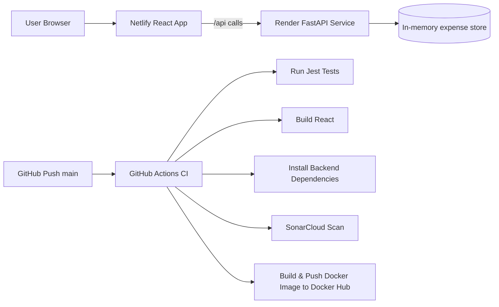

# Expense Tracker Dashboard (React + FastAPI) with Production CI/CD

A production-ready starter project that demonstrates a full CI/CD lifecycle for a full-stack application.

## Features

- Upload CSV expense data (`date,category,description,amount`)
- Add expenses manually
- Filter by category
- Monthly spending graph (bar chart)
- Category breakdown pie chart
- Total spending summary

---

## Project Structure

```text
.
├── .github/workflows/ci.yml
├── backend
│   ├── app
│   │   ├── __init__.py
│   │   ├── main.py
│   │   └── static/
│   └── requirements.txt
├── frontend
│   ├── public/index.html
│   ├── src
│   │   ├── App.js
│   │   ├── App.test.js
│   │   ├── components/utils.js
│   │   ├── index.js
│   │   └── styles.css
│   └── package.json
├── Dockerfile
├── netlify.toml
├── render.yaml
├── sonar-project.properties
└── .env.example
```

---

## Architecture Diagram



---

## CI/CD Pipeline (`.github/workflows/ci.yml`)

On each push to `main`:

1. Checkout repository
2. Setup Node.js and Python
3. Install frontend dependencies (`npm install`)
4. Run frontend Jest tests
5. Build frontend (`npm run build`)
6. Install backend dependencies (`pip install -r requirements.txt`)
7. Validate backend build (`python -m compileall backend/app`)
8. Run SonarCloud scan using `SONAR_TOKEN`
9. Build Docker image and push to Docker Hub using:
   - `DOCKER_USERNAME`
   - `DOCKER_PASSWORD`

---

## Deployment

### Frontend on Netlify

1. Create a Netlify site connected to this repo.
2. Netlify will read `netlify.toml`:
   - Base: `frontend`
   - Build command: `npm install && npm run build`
   - Publish directory: `build`
3. Set environment variable:
   - `REACT_APP_API_URL=https://<your-render-service>.onrender.com`

### Backend on Render

1. Create a Render Web Service from this repo.
2. Use `render.yaml` or set manually:
   - Runtime: Docker
   - Dockerfile: `./Dockerfile`
3. Deploy and copy the Render service URL.

---

## GitHub Secrets Required

Configure these in **Settings → Secrets and variables → Actions**:

- `DOCKER_USERNAME`
- `DOCKER_PASSWORD`
- `SONAR_TOKEN`

No secrets are hardcoded in source files.

---

## Local Development

### Backend

```bash
python -m venv .venv
source .venv/bin/activate
pip install -r backend/requirements.txt
uvicorn backend.app.main:app --reload --port 8000
```

### Frontend

```bash
cd frontend
npm install
npm start
```

Set API URL for frontend:

```bash
export REACT_APP_API_URL=http://localhost:8000
```

---

## Testing

Frontend tests use Jest via `react-scripts`:

```bash
cd frontend
npm test -- --watchAll=false
```

Includes at least two real tests:
- CSV parsing correctness
- Aggregation for monthly/category totals

---

## Live URLs

- Frontend (Netlify): `https://your-netlify-site.netlify.app`
- Backend (Render): `https://your-render-service.onrender.com`
- Docker image: `https://hub.docker.com/r/<DOCKER_USERNAME>/expense-tracker-dashboard`

Replace placeholders with your actual deployed URLs.

---

## Screenshots

Add screenshots after deploying (recommended path: `docs/screenshots/`).

Example markdown:

```md

```

